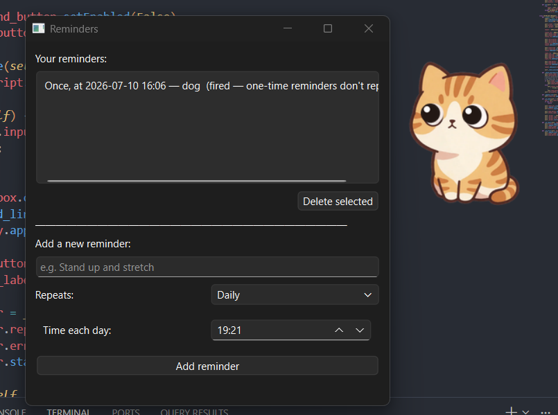
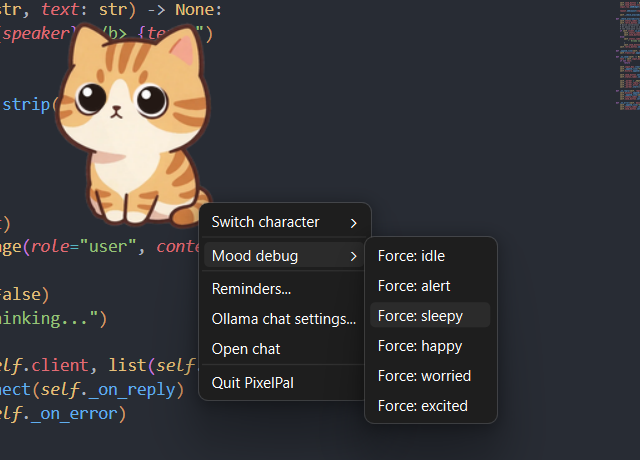

# PixelPal


A lightweight, frameless, always-on-top desktop pet — but not a looping-GIF
novelty. PixelPal's body and eyes are **separate rendering layers**: the eyes
track your cursor in real time with clamped, damped motion, so the pet reads
as alive rather than as a video clip stuck to your screen.





## What makes this different from a typical desktop pet

- **Layered cursor-tracking eyes**, not just a GIF loop — pupils slide
  smoothly inside an eye socket toward your cursor, clamped to a radius and
  damped so they never snap.
- **A reactive mood system** driven by real signals: CPU spikes, idle time,
  battery level, and (opt-in) git commits / failed builds in a watched repo.
- **Multi-pet awareness** — two PixelPal instances on the same screen notice
  each other and occasionally glance over instead of tracking the cursor.
- **Optional head tilt** toward the cursor, on top of eye movement, for a
  more analog feel.
- **Optional sound-reactive ear twitch**, using a lightweight amplitude poll
  (not audio recording).
- Ships as swappable **character packs** (folder or `.zip`) — the rendering
  engine is fully generic and never hardcodes a specific animal.

## Install

### Quick start (recommended)

```bash
git clone https://github.com/Vara693/pixelpal.git
cd pixelpal
./run.sh        # macOS/Linux
# or
run.bat         # Windows
```

The launcher scripts create a local virtual environment on first run and
install PixelPal into it.

### Manual install

```bash
python3 -m venv .venv
source .venv/bin/activate      # .venv\Scripts\activate.bat on Windows
pip install -e .
python -m pixelpal.main
```

Requires **Python ≥ 3.10**.

### CLI flags

```
python -m pixelpal.main [--image PATH] [--pos X,Y] [--wait SECONDS] [--character NAME] [--debug]
```

| Flag          | Meaning                                                        |
|---------------|------------------------------------------------------------------|
| `--character` | Character to launch (defaults to the last one you used)         |
| `--pos X,Y`   | Start position, overrides the saved config                      |
| `--wait N`    | Idle-hold seconds before the next animation cycle plays          |
| `--debug`     | Verbose logging                                                  |

## Usage

- **Drag** the pet with the left mouse button to move it.
- **Right-click** for the menu: switch character, install a new char pack,
  force a mood state (debug), open reminders, configure the local Ollama
  chat, open chat, or quit.
- Position and selected character are remembered between runs, saved to
  `config.ini` in a per-OS settings folder — **not inside the project
  folder itself**, which is why you won't find it by browsing `pixelpal/`.
  `reminders.json` lives in the same folder:

  | OS      | Exact path                                          |
  |---------|------------------------------------------------------|
  | Windows | `%APPDATA%\PixelPal\config.ini` (and `reminders.json`) |
  | macOS   | `~/Library/Application Support/PixelPal/`              |
  | Linux   | `~/.config/pixelpal/`                                    |

  On Windows, `%APPDATA%` isn't a folder you'll see sitting in `pixelpal/`
  — it's a system environment variable. To get there: press `Win + R`,
  type `%APPDATA%`, hit Enter. That opens `C:\Users\<you>\AppData\Roaming\`
  directly — `PixelPal\` will be inside it *after you've run the app at
  least once* (created on first launch, not shipped with the repo). Both
  files are intentionally excluded from git via `.gitignore` — they're
  per-user local state, nothing to commit or push.
- **Reminders**: right-click → **Reminders...** opens a real add/view/
  delete dialog (daily or one-time, with a date/time picker) — you don't
  need to touch `reminders.json` by hand unless you want to.

## The mood system

PixelPal cycles through `idle`, `alert`, `sleepy`, `happy`, `worried`, and
`excited` states based on pluggable signal sources:

- CPU usage spike → brief `alert`
- No input for N minutes (default 10) → `sleepy` (eyes half-close)
- Low battery → `worried` (persists until charged/plugged back in)
- A new commit in a watched git repo (**opt-in**) → `happy`
- A failure marker in a watched build log (**opt-in**) → `worried`

See `docs/MOOD_SYSTEM.md` for the full signal reference and how to add your
own signal source without touching the state machine.

## Authoring a character pack

Any folder with a `config.json`, a body sprite, and a pupil sprite is a
valid character pack — see `docs/CHARS.md` for the full guide and schema.
Only `name`, `body`, and `eyes` are required; head tilt, ear twitch, and
mood expressions are all optional per-character.

Install one via the right-click menu → **Install char pack...**, or drop
the folder directly into `chars/`.

## Local AI chat (Ollama)

Right-click → **Open chat** talks to a model running locally via
[Ollama](https://ollama.com).

**Why Ollama specifically, instead of a hosted API?** A few deliberate
reasons:
- **No API key, no account, no per-message cost.** Anthropic/OpenAI-style
  APIs require a key and bill per token; Ollama runs entirely on your own
  machine, so chatting with your pet is free and doesn't need any secret
  stored in `config.ini` or the repo.
- **Privacy.** Nothing you type to your pet leaves your computer — no
  request ever goes over the network. This matches PixelPal's general
  privacy stance (see the activity-tracking section below).
- **It's genuinely optional.** If you never touch the chat feature, this
  dependency does nothing — there's no background process, no required
  signup, no cost, just a client that talks to `http://localhost:11434` if
  something's listening there.

**Ollama is not bundled with PixelPal and must be installed separately** —
this is documented explicitly right here (previously this wasn't spelled
out clearly enough). If you skip this, every other feature (eyes, mood
system, reminders, multi-pet) works completely normally; only the chat
window will show "Ollama not reachable."

Setup:
1. Install Ollama: <https://ollama.com/download>
2. Pull the default model (or whichever you configure below):
   `ollama pull llama3.2`
3. Confirm it's running: `curl http://localhost:11434` should say
   `Ollama is running`. If not, run `ollama serve`.
4. Open chat from PixelPal's right-click menu. If you opened it *before*
   starting Ollama, click **Retry connection** in the chat window rather
   than closing and reopening it.

Configure host/model in `config.ini` under `[ollama]` (see the config.ini
location table above). **Nothing Ollama-related needs to be pushed to your
repo** — no API key exists to leak, and the actual local server/model live
entirely outside the project folder on your machine, not as project files.

## Privacy stance on activity tracking

The idle/"sleepy" mood signal needs to know *whether* you've interacted with
your computer recently. To do that, PixelPal counts **aggregate** key-press
and click events and timestamps the last one — nothing more.

- **No key values are ever recorded.** PixelPal cannot tell you what you
  typed, only that *a* key was pressed and when.
- No clipboard access, no screen capture, no network transmission of
  activity data. Everything stays in memory for the current session.
- This logic lives entirely in `pixelpal/features/activity_tracker.py`.

All optional signal sources (git watching, audio level polling, multi-pet
discovery) are **off by default** and must be explicitly enabled.

## Known limitations

- **Linux/Wayland**: drag-to-move and always-on-top behavior depend on your
  compositor's support for layer-shell-style windows; behavior varies by
  desktop environment.
- **Linux/X11 without a compositor**: true transparency isn't available, so
  PixelPal falls back to clipping the window to the sprite's silhouette
  (`setMask`) instead of showing a black box.
- Multi-pet awareness relies on a shared local registry file
  (`$XDG_RUNTIME_DIR/pixelpal/active_pets.json` or the OS temp dir) — it
  only sees other PixelPal instances run by the same user on the same
  machine.

## Project structure — what each folder does

| Folder | What's in it | When you'd actually open it |
|--------|---------------|-------------------------------|
| `chars/` | Character art + `config.json` per animal (`cat/`, `fox/`, `owl/`, ...) | **This is the one you'll live in.** Adding/customizing a character, adjusting eye or expression positions. |
| `pixelpal/core/` | Main window (`overlay_window.py`), drag-to-move, right-click menu, `config.ini` read/write | Rarely — this is app plumbing, not character customization. |
| `pixelpal/rendering/` | *How* rendering works: eye tracking math, body animation cycling, head tilt, ear twitch, expression overlay positioning | Only if you're changing rendering behavior itself, not what a character looks like. |
| `pixelpal/mood/` | The mood state machine + pluggable signal sources (CPU, battery, idle time, git watch) | Tuning when/how moods trigger, or adding a new signal source. |
| `pixelpal/features/` | Reminders, the Ollama chat client + window, privacy-respecting activity tracking | Rarely, unless changing chat/reminder behavior. |
| `pixelpal/charpack/` | Char pack schema validation, loading, and the zip installer | Only if you're changing what's *allowed* in a `config.json`, not writing one. |
| `pixelpal/multipet/` | Shared registry + "glance at nearby pets" logic (partially wired up) | Future multi-pet work. |
| `pixelpal/utils/` | Pure math (`geometry.py`) and OS-specific quirks (`platform_utils.py`) | Rarely. |
| `tools/` | Dev-only scripts — `eye_picker.html`, `find_eye_coords.py`, `make_gif.py`, `generate_placeholder_art.py`. **Not shipped/run by the app itself.** | Whenever you're building a new character pack. |
| `tests/` | Automated checks for the pure-logic pieces | Confirming nothing broke after an edit. Run with `pytest`. |
| `docs/` | `CHARS.md` (character authoring guide), `MOOD_SYSTEM.md` (signal reference) | Reference while customizing. |
| `packaging/` | PyInstaller `.spec` files for building a standalone `.exe`/`.app`/binary | Distributing the app to someone without Python installed. |
| `.github/workflows/` | CI: runs tests and builds releases automatically on GitHub | Only relevant once this is pushed to GitHub. |

## Recent changes

A running log of notable fixes/additions, most recent first:

- **Real reminders dialog.** Right-click → **Reminders...** now opens an
  actual add/view/delete UI (`pixelpal/features/reminder_dialog.py`)
  instead of a read-only summary — no more hand-editing `reminders.json`.
  New reminders take effect immediately, no restart needed.
- **Expression positioning fixed.** `expressions.<mood>` in `config.json`
  now takes an `{x, y}` anchor (see `docs/CHARS.md`) instead of defaulting
  to the window's top-left corner — previously most mood expressions were
  invisible or misplaced; only `sleepy` (handled separately via
  `eyes.closed`) reliably showed. All three bundled characters now have
  distinct `happy`/`worried`/`alert`/`excited`/`sleepy` looks.
- **Ctrl+C now works.** Previously only the right-click **Quit** menu item
  or killing the process worked from the terminal; SIGINT is now handled
  properly.
- **Chat window retry button.** No more closing/reopening the whole chat
  window after starting Ollama — click **Retry connection** instead.
- **Coordinate-finding tools added**: `tools/eye_picker.html` (click-based,
  any art style) and `tools/find_eye_coords.py` (automatic, for art with
  visible pupils).
- **`tools/make_gif.py` added** for building idle-animation GIFs from
  frame sequences, with a built-in check that rejects mismatched frame
  sizes (a common cause of eye misalignment).

## Development

```bash
pip install -e ".[dev]"
pytest
```

Tests cover the pure-logic pieces: eye-angle/damping math, mood state
transitions, char-pack schema validation, and config persistence — anything
that needs Qt or the OS is kept thin and pushed to the edges on purpose.

## Packaging

Basic PyInstaller specs live in `packaging/pyinstaller/`. From the repo
root:

```bash
pip install -e ".[dev]"
pyinstaller packaging/pyinstaller/linux.spec      # or windows.spec / macos.spec
```

## License

See `LICENSE.txt`.
