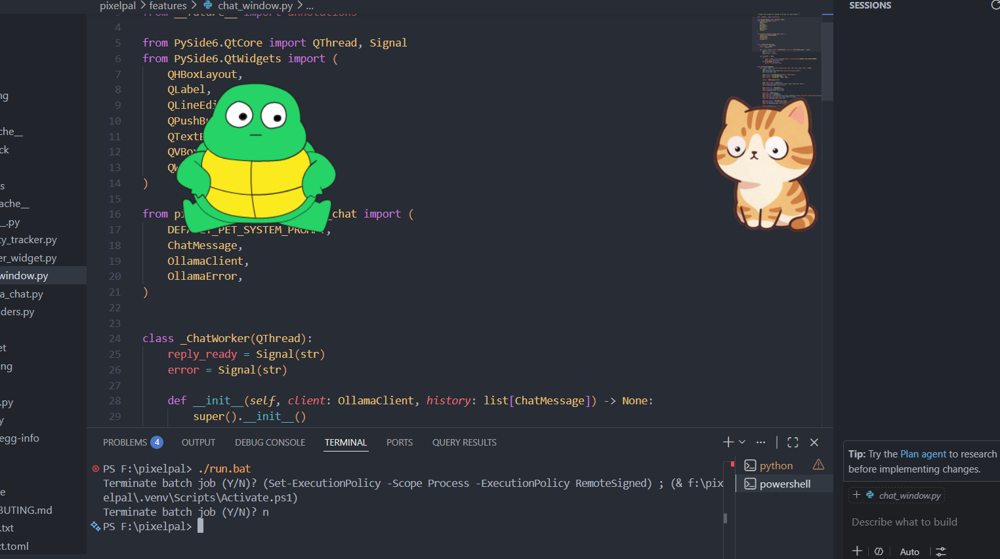

# PixelPal

A lightweight, frameless, always-on-top desktop pet — but not a looping-GIF
novelty. PixelPal's body and eyes are **separate rendering layers**: the eyes
track your cursor in real time with clamped, damped motion, so the pet reads
as alive rather than as a video clip stuck to your screen.




## What makes this different from a typical desktop pet

- **Layered cursor-tracking eyes**, not just a GIF loop — pupils slide
  smoothly inside an eye socket toward your cursor, clamped to a radius and
  damped so they never snap.
- **A reactive mood system** driven by real signals: CPU spikes, idle time,
  battery level, and (opt-in) git commits / failed builds in a watched repo.
- **Multi-pet awareness** — two PixelPal instances on the same screen notice
  each other and occasionally glance over instead of tracking the cursor.
- **Optional head tilt** toward the cursor, on top of eye movement, for a
  more analog feel.
- **Optional sound-reactive ear twitch**, using a lightweight amplitude poll
  (not audio recording).
- Ships as swappable **character packs** (folder or `.zip`) — the rendering
  engine is fully generic and never hardcodes a specific animal.

## Install

### Quick start (recommended)

```bash
git clone https://github.com/Vara693/pixelpal.git
cd pixelpal
./run.sh        # macOS/Linux
# or
run.bat         # Windows
```

The launcher scripts create a local virtual environment on first run and
install PixelPal into it.

### Manual install

```bash
python3 -m venv .venv
source .venv/bin/activate      # .venv\Scripts\activate.bat on Windows
pip install -e .
python -m pixelpal.main
```

Requires **Python ≥ 3.10**.

### CLI flags

```
python -m pixelpal.main [--image PATH] [--pos X,Y] [--wait SECONDS] [--character NAME] [--debug]
```

| Flag          | Meaning                                                        |
|---------------|------------------------------------------------------------------|
| `--character` | Character to launch (defaults to the last one you used)         |
| `--pos X,Y`   | Start position, overrides the saved config                      |
| `--wait N`    | Idle-hold seconds before the next animation cycle plays          |
| `--debug`     | Verbose logging                                                  |

## Usage

- **Drag** the pet with the left mouse button to move it.
- **Right-click** for the menu: switch character, install a new char pack,
  force a mood state (debug), open reminders, configure the local Ollama
  chat, open chat, or quit.
- Position and selected character are remembered between runs
  (`~/.config/pixelpal/config.ini` on Linux; see
  `pixelpal/utils/platform_utils.py` for the Windows/macOS equivalents).

## The mood system

PixelPal cycles through `idle`, `alert`, `sleepy`, `happy`, `worried`, and
`excited` states based on pluggable signal sources:

- CPU usage spike → brief `alert`
- No input for N minutes (default 10) → `sleepy` (eyes half-close)
- Low battery → `worried` (persists until charged/plugged back in)
- A new commit in a watched git repo (**opt-in**) → `happy`
- A failure marker in a watched build log (**opt-in**) → `worried`

See `docs/MOOD_SYSTEM.md` for the full signal reference and how to add your
own signal source without touching the state machine.

## Authoring a character pack

Any folder with a `config.json`, a body sprite, and a pupil sprite is a
valid character pack — see `docs/CHARS.md` for the full guide and schema.
Only `name`, `body`, and `eyes` are required; head tilt, ear twitch, and
mood expressions are all optional per-character.

Install one via the right-click menu → **Install char pack...**, or drop
the folder directly into `chars/`.

## Local AI chat (Ollama)

Right-click → **Open chat** talks to a model running locally via
[Ollama](https://ollama.com) (`http://localhost:11434` by default, no API
key). If Ollama isn't running, the chat window tells you so instead of
failing silently. Configure the host/model in `config.ini` under `[ollama]`.

## Privacy stance on activity tracking

The idle/"sleepy" mood signal needs to know *whether* you've interacted with
your computer recently. To do that, PixelPal counts **aggregate** key-press
and click events and timestamps the last one — nothing more.

- **No key values are ever recorded.** PixelPal cannot tell you what you
  typed, only that *a* key was pressed and when.
- No clipboard access, no screen capture, no network transmission of
  activity data. Everything stays in memory for the current session.
- This logic lives entirely in `pixelpal/features/activity_tracker.py`.

All optional signal sources (git watching, audio level polling, multi-pet
discovery) are **off by default** and must be explicitly enabled.

## Known limitations

- **Linux/Wayland**: drag-to-move and always-on-top behavior depend on your
  compositor's support for layer-shell-style windows; behavior varies by
  desktop environment.
- **Linux/X11 without a compositor**: true transparency isn't available, so
  PixelPal falls back to clipping the window to the sprite's silhouette
  (`setMask`) instead of showing a black box.
- Multi-pet awareness relies on a shared local registry file
  (`$XDG_RUNTIME_DIR/pixelpal/active_pets.json` or the OS temp dir) — it
  only sees other PixelPal instances run by the same user on the same
  machine.

## Development

```bash
pip install -e ".[dev]"
pytest
```

Tests cover the pure-logic pieces: eye-angle/damping math, mood state
transitions, char-pack schema validation, and config persistence — anything
that needs Qt or the OS is kept thin and pushed to the edges on purpose.

## Packaging

Basic PyInstaller specs live in `packaging/pyinstaller/`. From the repo
root:

```bash
pip install -e ".[dev]"
pyinstaller packaging/pyinstaller/linux.spec      # or windows.spec / macos.spec
```

## License

See `LICENSE.txt`.
